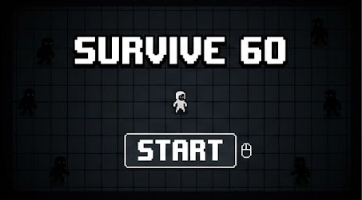
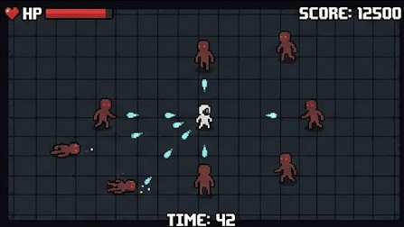
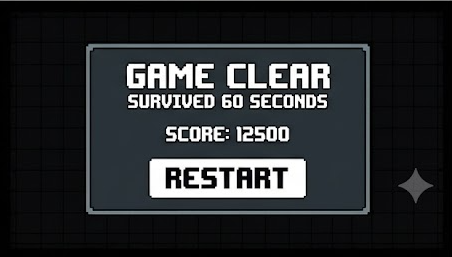
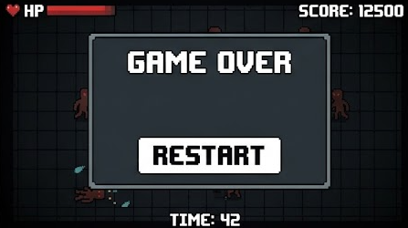

#gameproject
-작성자  : 나준희
-작성일 : 08/26
-업데이트 : 09/ 05
- 게임제목 survive 60second

##게임 개요  

**- 60초동안 몰려오는 적을 처치해가며 생존하는 탑뷰 뱀파이어서바이벌류 게임**

##게임 시작 화면

##인 게임 화면

##게임 종료 화면

게임을 클리어했을 경우

게임을 클리어하지 못 했을 경우

## 게임 목적

**- 몰려오는 적을 처치하며 최대한 오래 생존한다.

**- 무기의 조합으로 강해진다.**

**- 적을 처치하여 높은 점수를 획득한다.**

**- 300초 동안 생존하면 게임 클리어한다.**

## 조작방법

**- w a s d 로 이동 esc로 종료**

**##게임 규칙**

**- 게임이 시작되면 적이 맵 외곽에서 생성된다.**

**- 적은 플레이어를 향해 이동한다.**

**- 플레이어는 이동하면서 적의 공격을 피한다.**

**- 플레이어의 무기는 일정 시간마다 자동으로 발사된다.**

**- 공격에 맞은 적의 HP가 감소한다.**

**- 적의 HP가 0이 되면 적이 처치된다.**

**- 적을 처치하면 점수를 획득한다.**

**- 시간이 지날수록 적의 생성 빈도와 이동 속도가 증가한다.**

**- 플레이어의 HP가 0이 되면 게임 오버된다.**

**- 60초를 생존하면 게임에서 승리한다.**

## 점수 / 승부 규칙

**- 일반 적 처치	+100**

**- 강한 적 처치	+300**

**- 보스 처치		+1,000**

**최종 점수는 게임 종료 시 표시한다.**

## 게임 시작 조건

**- 게임 실행 후 시작 화면에서 START 버튼을 누르면 게임이 시작된다.**

**- 플레이어의 HP는 100으로 시작한다.**

**- 게임 타이머는 300초로 설정된다.**

**- 플레이어는 맵 중앙에서 시작한다.**

##게임 종료 조건

**-플레이어의 HP가 0이 되면 게임 오버**

**-게임 종료 후 최종 점수를 표시하고 RESTART 버튼을 통해 게임을 다시 시작할 수 있다.**

## 플레이어 행동

**- 자동 공격**

**플레이어가 일정 시간마다 자동으로 투사체를 발사한다.**

**가장 가까운 적을 대상으로 공격하도록 설정한다.**

**- 피하기**

**- 적과의 거리를 유지하며 적의 공격을 피한다.**

**- 체력 관리**

**적에게 공격받으면 HP가 감소한다.**

**- 무기 선택**

**3종의 무기중 하나를 골라 게임을 시작한다**

## 적 행동

**- 이동**

**적은 플레이어의 위치를 지속적으로 추적한다.**

**- 공격**

**적이 플레이어에게 접근하면 충돌하여 플레이어에게 피해를 준다.**

**- 생성**

**일정 시간마다 맵 외곽에서 새로운 적이 생성된다.**

**게임이 진행될수록 적의 생성 빈도가 증가한다.**

##게임 화면

**- 좌측 상단: 플레이어 HP**

**- 우측 상단: 점수**

**- 하단 중앙: 남은 시간**

**- 중앙: 플레이어**

**- 주변: 적**

**- 플레이어 주변: 자동 공격 투사체**

## 게임 진행 흐름

**- 게임 시작 -> 무기 선택 -> 플레이어 생성 -> 적 생성 -> 적 처치하여 레벨업으로 무기 강화 ->  60초마다 보스 생성 ->** 

**적 개체,난이도 증가 -> 300초 생존 시 클리어**

## 주요 게임 오브젝트 목록

**- 플레이어, 적, 무기, 보스, 게임매니저, ui, 맵**

## 필요한 이미지 목록

**- 플레이어 캐릭터**

**- 무기 3종** 

**- 일반 적 2종**

**- 강한 적 2종**

**- 보스** 

**- 투사체 3종
##UI

**게임 배경 1종**

**- HP 게이지**

**- START 버튼**

**- RESTART 버튼**

**- 게임 오버 화면**

**- 게임 클리어 화면**

## 필요한 사운드 목록

**- BGM**

**- 플레이어 공격음**

**- 적 피격음**

**- 적 처치음**

**- 플레이어 피격음**

**- 게임 오버 효과음**

**- 게임 클리어 효과음**

**- 게임 시작음**

**- 배경음악**

**- 보스 등장 효과음**